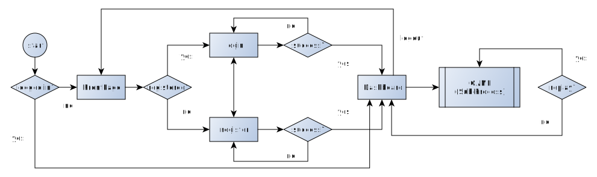
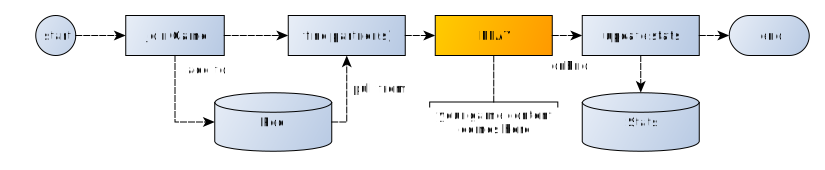

[](https://travis-ci.org/jankapunkt/meteor-game-skeleton)
[](https://codeclimate.com/github/jankapunkt/meteor-game-skeleton/maintainability)
[](https://gitlicense.com/license/jankapunkt/meteor-game-skeleton)


# meteor-game-skeleton

A Meteor skeleton app as foundation for games.

# About the App

### General Vision and Use Case

* Provide out-of the box runnable app template for browser based games
* Core-features like routing, translation, user login, registration, logging
* Minimal application cycle, extensible for many gaming variations
* Extensible API, providig only the most basic functionalities
* Server side methods and api decouples from ui (to allow developers to choose their own rendering engine)
* Minimal app but fully tested


### APP Flow



### Game Flow




# Conventions

### Class Structure

There are no real 'classes' in use. However, most API definitions are exported as a constant (non-freezed) object, following a certain structure:

```javascript
export const SomeDefinition = {

    // will be the name of the collection that is created for this definition
    name:"someName",

    // i18n compatible definition for a translated name
    label:"someName.title",

    // fontawesome icon name without any preceeding 'fa-' naming
    icon:"database",

    // schmema of the collection, attached and checked using aldeed:collection2-core package
    schema:{ /*...*/ },

    // defining meteor-methods to be passed to a method factory
    methods:{ /*...*/ },

    // defining meteor-methods to be passed to a method factory
    methods:{ /*...*/ },

    // dependencies from other API definitions to be loaded as subscriptions,
    // usually defined in the dependant's publications
    dependencies:[ {/*..*/} ],

    // define helper functions
    helpers:{ /*...*/ },
}
```

The definitions are passed into the factories (`CollectionFactory`, `MethodFactory`, `PublicationFactory`) in order to build the initial application structure.

```javascript
{
    methods:{

        // definition of a method
        update:{

            // name, used to be called by Metor.call
            name:"someObject.method.name",

            // schema to validate parameters, used in `validate` (see `mdg:validated-method`)
            schema:{ /*...*/ },
        }
    }
}

```

### DRY

To enforce the DRY principle, the following conventions should be regarded:

* DefObjects should be used where possible to decouple definition from implementation
* Use factories to create collections, methods, publications from DefObjects (see `imports/api/factories`)


### Translation

* All labels are defined untranslated as i18n code in camelCase (for example: `"componentName.featureName.labelName"`)
* No server-side translation, all data is passed to client as untranslated string
* This also applies for error messages or data, that is saved in documents
* Translation work is done by client (reactively), depending on client's language


### Mobile First

* Keep views mobile friendly
* Write code, that can be compiled into mobile app (android/ios), add tests to ensure mobile compatibility


### Cheating

The following client actions should always be server-side checked:

actions that affect or are affected by

* game logic
* rules
* scores
* other game entities than player
* players stats
* any data that is made persistent

